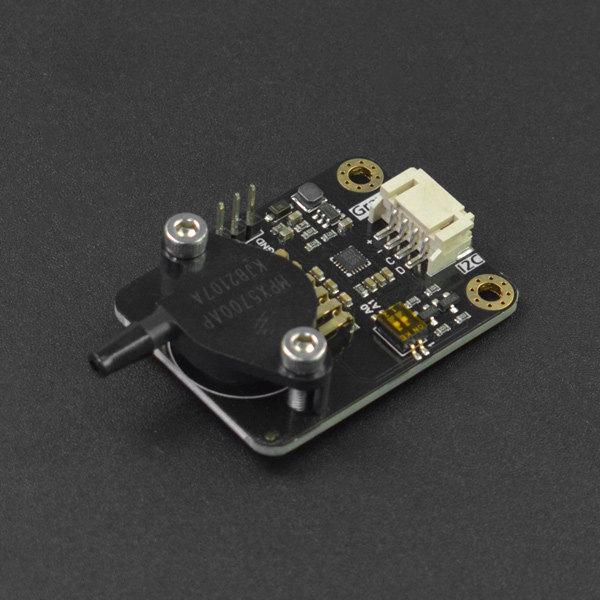

# DFRobot_MPX5700
- [English Version](./README.md)

这是一款Arduino兼容的气压传感器模组，测量范围15-700kPa，支持I2C数字输出，可以根据已知气压值进行标定，可以快速、准确的测量管路或其他环境中的气压值。适用于管路气压检测，自然科学实验等场景。



## 产品链接（[https://www.dfrobot.com.cn/goods-3416.html](https://www.dfrobot.com.cn/goods-3416.html)）
SKU：SEN0456

## 目录

* [概述](#概述)
* [库安装](#库安装)
* [方法](#方法)
* [兼容性](#兼容性y)
* [历史](#历史)
* [创作者](#创作者)

## 概述

这个库提供了一个获取大气压强的例程和一个校准例程

## 库安装

使用此库前，请首先下载库文件，将其粘贴到\Arduino\libraries目录中，然后打开examples文件夹并在该文件夹中运行演示。

## 方法

```C++
    /**
     * @fn begin
     * @brief 初始化函数
     * @return bool类型，表示返回初始化的状态
     * @retval TRUE 初始化成功
     * @retval FALSE 初始化失败
     */
    bool begin(void);

    /**
     * @fn setMeanSampleSize
     * @brief 设置样本量大小，即对多少的原始数据取均值
     * @param size 样本量大小
     */
    void setMeanSampleSize(uint8_t size);

    /**
     * @fn getPressureValue_kpa
     * @brief 获取此时大气压强
     * @param ifcalibration 是否输出经过校准的大气压值
     * @return float类型
     */
    float getPressureValue_kpa(uint8_t ifcalibration);

    /**
     * @fn calibration_kpa
     * @brief 设置标准大气压强
     * @param standard_values 校准用的大气压强的参考值
     */
    void calibration_kpa(float standard_values);

  protected:
    /**
     * @fn writeReg
     * @brief 向设备写入数据
     * @param Reg  需要写入的寄存器地址
     * @param Data 等待写入寄存器的数据
     * @param len  等待写入的数据的长度
     */
    void writeReg(uint8_t Reg, void *Data, uint8_t len);
    
    /**
     * @fn readReg
     * @brief 从设备读取数据
     * @param Reg  需要读取的寄存器地址
     * @param Data 等待读取寄存器的数据
     * @param len  等待读取的数据的长度
     * @return int16_t类型
     */
    int16_t readReg(uint8_t Reg, uint8_t *Data, uint8_t len);

```
## 兼容性

MCU                | Work Well | Work Wrong | Untested  | Remarks
------------------ | :----------: | :----------: | :---------: | -----
Arduino Uno  |      √       |             |            | 
Leonardo  |      √       |             |            | 
Meag2560 |      √       |             |            | 
M0 |      √       |             |            | 
ESP32 |      √       |             |            | 
ESP8266 |      √       |             |            | 

## 历史

- 2021/5/14 - 1.0.0版本

## 创作者

Written by Pengkaixing(kaixing.peng@dfrobot.com), 2021. (Welcome to our [website](https://www.dfrobot.com/))