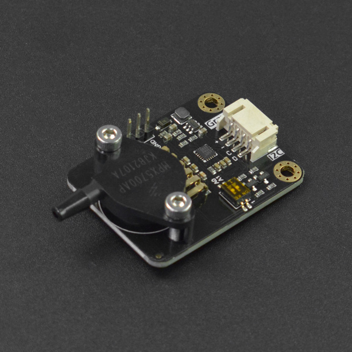

# DFRobot_MPX5700
- [中文版](./README_CN.md)

This is a Arduino compatible pressure sensor module with a measuring range of 15-700kPa, which supports I2C digital output and can be calibrated according to known pressure values and allows fast and accurate measurement of pressure values in pipelines or other environments. It is suitable for pipeline air pressure detection, natural science experiments and other scenarios.



## Product Link（[https://www.dfrobot.com/product-2490.html](https://www.dfrobot.com/product-2490.html)）

SKU：SEN0456

## Table of Contents

* [Summary](#summary)
* [Installation](#installation)
* [Methods](#methods)
* [Compatibility](#compatibility)
* [History](#history)
* [Credits](#credits)

## Summary

The library provides a routine for getting air pressure and one for calibration.

## Installation

Download the library to Raspberry Pi before use, then open the routine folder. Input python demox.py into the command line to execute a routine demox.py.

## Methods

```python

  '''!
    @brief Set sample size, i.e take the mean value based on how many raw data
    @param size Sample size
  '''
  def set_mean_sample_size(self, size):

  '''
    @brief Get the current air pressure
    @param ifcalibration Whether to output calibrated air pressure value
    @return float type
  '''
  def get_pressure_value_kpa(self,ifcalibration):

  '''
    @brief Set standard air pressure
    @param standard_values The air pressure reference value for calibration
  '''    
  def calibration_kpa(self,standard_values):
    
```


## Compatibility

| MCU         | Work Well | Work Wrong | Untested | Remarks |
| ------------ | :--: | :----: | :----: | :--: |
| RaspberryPi2 |      |        |   √    |      |
| RaspberryPi3 |      |        |   √    |      |
| RaspberryPi4 |  √   |        |        |      |

* Python Version

| Python  | Work Well | Work Wrong | Untested | Remarks |
| ------- | :--: | :----: | :----: | ---- |
| Python2 |  √   |        |        |      |
| Python3 |  √   |        |        |      |
## History

- 2021/5/14 - 1.0.0 Version

## Credits

Written by PengKaixing(kaixing.peng@dfrobot.com), 2021. (Welcome to our [website](https://www.dfrobot.com/))
